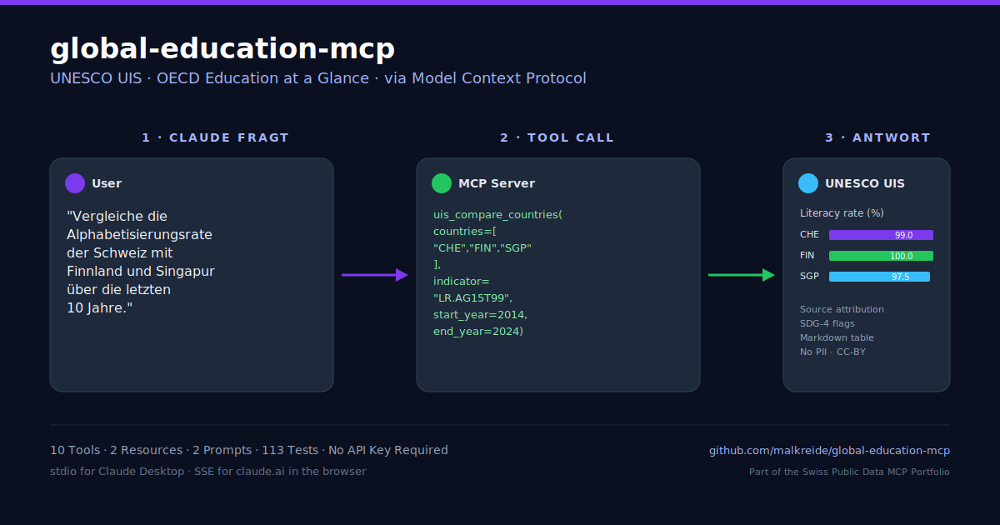

> 🇨🇭 **Part of the [Swiss Public Data MCP Portfolio](https://github.com/malkreide)**

# 🎓 global-education-mcp


[](https://opensource.org/licenses/MIT)
[](https://www.python.org/downloads/)
[](https://modelcontextprotocol.io/)
[](https://uis.unesco.org/)
[](https://www.oecd.org/education/education-at-a-glance/)
[](tests/)
[](https://uis.unesco.org/bdds)


> MCP server for international education data – UNESCO UIS (4,000+ indicators across all member countries) and OECD Education at a Glance via SDMX. No API keys required.

[🇩🇪 Deutsche Version](README.de.md)



---

## Overview

**global-education-mcp** gives AI assistants like Claude a complete international education intelligence system – literacy rates, enrolment ratios, education expenditure, teacher salaries, gender parity and SDG-4 monitoring, all accessible through a single standardised MCP interface.

The server bridges two of the most authoritative sources for internationally comparable education statistics: UNESCO UIS (global coverage, 4,000+ indicators) and the OECD's annual *Education at a Glance* (38 OECD countries, SDMX REST API). Both are open and require no API key.

**Anchor demo query:** *"Compare Switzerland's education expenditure as a percentage of GDP with Finland, Singapore and South Korea over the last 10 years – and flag any SDG-4 gaps."*

---

## Features

- 🌍 **UNESCO UIS** – 4,000+ indicators, all UNESCO member countries, no API key
- 📊 **OECD Education at a Glance** – 38 OECD countries + partners via SDMX REST
- 🔍 **Indicator search** – browse and filter the full UNESCO indicator catalogue
- 🗺️ **Multi-country comparison** – benchmark any indicator across multiple countries
- 🏫 **Country education profiles** – 10 core indicators in one call
- 🎯 **SDG-4 monitoring** – structured reporting on Education for All targets
- 📈 **OECD dataset search** – discover and retrieve Education at a Glance dataflows
- 🔑 **No API keys required** – fully open data, zero setup friction
- ☁️ **Dual transport** – stdio for Claude Desktop, Streamable HTTP/SSE for cloud deployment
- 🛡️ **Graceful degradation** – API failures return helpful messages with local reference fallback

---

## Prerequisites

- Python 3.11+
- `uv` (recommended) or `pip`
- No API keys needed

---

## Installation

```bash
# Clone the repository
git clone https://github.com/malkreide/global-education-mcp.git
cd global-education-mcp

# Install
pip install -e ".[dev]"
```

Or with `uvx` (no permanent installation):

```bash
uvx global-education-mcp
```

---

## Quickstart

```bash
# Start the server (stdio mode for Claude Desktop)
global-education-mcp
```

Try it immediately in Claude Desktop:

> *"What is Switzerland's literacy rate compared to Finland and Singapore?"*
> *"Show me education expenditure as % of GDP for CHE, DEU and AUT over the last 10 years."*

---

## Configuration

### Claude Desktop Configuration

**Windows** (`%APPDATA%\Claude\claude_desktop_config.json`):

```json
{
  "mcpServers": {
    "global-education": {
      "command": "uvx",
      "args": ["global-education-mcp"]
    }
  }
}
```

**macOS** (`~/Library/Application Support/Claude/claude_desktop_config.json`):

```json
{
  "mcpServers": {
    "global-education": {
      "command": "uvx",
      "args": ["global-education-mcp"]
    }
  }
}
```

A ready-to-use `claude_desktop_config.json` is included in the repository root.

### Cloud Deployment (SSE for browser access)

For use via **claude.ai in the browser** (e.g. on managed workstations without local software):

**Render.com (recommended):**
1. Push/fork the repository to GitHub
2. On [render.com](https://render.com): New Web Service → connect GitHub repo
3. Set environment variables in the Render dashboard:
   ```
   MCP_TRANSPORT=sse
   PORT=8000
   ```
4. In claude.ai under Settings → MCP Servers, add: `https://your-app.onrender.com/sse`

**Docker:**
```bash
docker build -t global-education-mcp .
docker run -p 8000:8000 \
  -e MCP_TRANSPORT=sse \
  global-education-mcp
```

> 💡 *"stdio for the developer laptop, SSE for the browser."*

---

## Available Tools

### UNESCO UIS Tools

| Tool | Description |
|---|---|
| `uis_list_indicators` | Search and list available indicators (4,000+) |
| `uis_list_countries` | List countries and regions with ISO codes |
| `uis_get_education_data` | Retrieve data for a specific indicator |
| `uis_compare_countries` | Multi-country comparison for one indicator |
| `uis_country_education_profile` | Full education profile (10 core indicators) |
| `uis_list_versions` | List available database versions |

### OECD Tools

| Tool | Description |
|---|---|
| `oecd_list_education_datasets` | List Education at a Glance datasets |
| `oecd_get_education_indicator` | Retrieve OECD education data via SDMX |
| `oecd_search_datasets` | Search OECD dataflows by keyword |

### Cross-Source Tools

| Tool | Description |
|---|---|
| `education_benchmark_countries` | Benchmark multiple countries across 5 focus themes (UNESCO UIS) |

### Resources & Prompts

**Resources:**
- `education://indicators/unesco` – Quick reference for core UNESCO indicators
- `education://datasets/oecd` – Quick reference for OECD Education at a Glance dataflows

**Prompts:**
- `bildungsvergleich_schweiz` – Switzerland vs. Finland, Singapore, Japan
- `sdg4_monitoring` – SDG-4 report for CH/DE/AT

### Country Codes

ISO 3166-1 Alpha-3 standard:

| Code | Country | Code | Country |
|---|---|---|---|
| `CHE` | Switzerland | `FIN` | Finland |
| `DEU` | Germany | `SGP` | Singapore |
| `AUT` | Austria | `KOR` | South Korea |
| `FRA` | France | `JPN` | Japan |
| `SWE` | Sweden | `USA` | United States |

### Example Use Cases

| Query | Tool |
|---|---|
| *"What is Switzerland's literacy rate vs. Finland and Singapore?"* | `uis_compare_countries` |
| *"Education expenditure as % of GDP for CHE, DEU, AUT over 10 years"* | `uis_get_education_data` |
| *"Create a full education profile for South Korea"* | `uis_country_education_profile` |
| *"Which OECD datasets cover teacher salaries?"* | `oecd_search_datasets` |
| *"Compare secondary graduation rates across 5 European countries"* | `education_benchmark_countries` |
| *"Create an SDG-4 monitoring report for Switzerland"* | `sdg4_monitoring` (prompt) |

→ [More use cases by audience](EXAMPLES.md) →

---

## Architecture

```
┌─────────────────┐     ┌──────────────────────────────┐     ┌────────────────────┐
│   Claude / AI   │────▶│   Global Education MCP       │────▶│   UNESCO UIS API   │
│   (MCP Host)    │◀────│   (MCP Server)               │◀────│   uis.unesco.org   │
└─────────────────┘     │                              │     └────────────────────┘
                        │  10 Tools · 2 Resources      │
                        │   · 2 Prompts                │     ┌────────────────────┐
                        │  Stdio | SSE                 │────▶│   OECD SDMX API    │
                        │                              │◀────│   sdmx.oecd.org    │
                        │  server.py                   │     └────────────────────┘
                        │   + api_client.py            │
                        └──────────────────────────────┘
```

### Infrastructure Components

| Component | Metaphor | Function |
|---|---|---|
| HTTPClient | Postal service | Handles all outbound HTTP requests, retries and timeouts |
| SimpleCache | Whiteboard | In-memory TTL cache for repeated queries |
| GracefulFallback | Safety net | Returns local reference data when APIs are unavailable |
| SDMXParser | Translator | Converts OECD SDMX/XML responses to clean JSON |

### Caching Strategy

| Data Source | Cache TTL | Rationale |
|---|---|---|
| UNESCO UIS indicators | 3600s | Catalogue is stable; updated annually |
| UNESCO UIS country data | 1800s | Figures update yearly, not intraday |
| OECD dataset list | 3600s | Education at a Glance is an annual publication |
| OECD indicator data | 1800s | Same annual update cycle |
| Country/region list | 86400s | ISO codes and country lists are highly stable |

---

## Project Structure

```
global-education-mcp/
├── src/global_education_mcp/       # Main package
│   ├── __init__.py                 # Package metadata, version
│   ├── server.py                   # FastMCP server, 10 tools, 2 resources, 2 prompts
│   └── api_client.py               # HTTP client, UNESCO UIS + OECD wrappers, formatters
├── tests/
│   ├── test_server.py              # 39 tests (basic / intermediate / advanced)
│   └── test_extended_scenarios.py  # 74 tests across 8 categories
├── claude_desktop_config.json      # Ready-to-use Claude Desktop config
├── pyproject.toml                  # Build configuration (hatchling)
├── CHANGELOG.md
├── CONTRIBUTING.md
├── LICENSE
├── README.md                       # This file (English)
└── README.de.md                    # German version
```

---

## Known Limitations

- **UNESCO UIS:** Some indicators have sparse coverage for low-income countries or recent years
- **OECD SDMX:** Occasional API timeouts on large multi-country, multi-year requests; reduce the year range if needed
- **OECD coverage:** 38 OECD members + select partners – does not cover all UNESCO member states
- **Historical depth:** UNESCO UIS data availability varies by indicator; not all series go back to 1970
- **Language:** UNESCO UIS returns indicator labels in English only; OECD labels may vary by dataflow
- **No real-time data:** Both sources publish annually – figures reflect the latest published edition, not live school statistics

---

## 🛡️ Safety & Limits

| Aspect | Details |
|--------|---------|
| **Access** | Read-only (`readOnlyHint: true`) — the server cannot modify, write or delete any data |
| **Personal data** | No personal data — UNESCO UIS and OECD EaG publish only aggregated, country-level statistics |
| **Rate limits** | Built-in per-query caps (max 50 indicators per search, max 10 countries per comparison, conservative year ranges) |
| **Caching** | In-memory TTL cache (1800–86400s) reduces upstream load and respects publisher capacity |
| **Timeout** | 30 seconds per upstream API call, with graceful fallback to local reference data |
| **Authentication** | No API keys required — both UNESCO UIS and OECD SDMX are publicly accessible |
| **Licenses** | UNESCO UIS data under [CC BY-SA 3.0 IGO](https://creativecommons.org/licenses/by-sa/3.0/igo/); OECD data under [OECD Terms and Conditions](https://www.oecd.org/termsandconditions/) |
| **Terms of Service** | Subject to ToS of the respective sources: [UNESCO UIS](https://uis.unesco.org/en/terms-and-conditions-use), [OECD](https://www.oecd.org/termsandconditions/) — please cite the source when redistributing |
| **Attribution** | All tool responses include source attribution (`Source: UNESCO UIS` / `Source: OECD Education at a Glance`) |

---

## Testing

```bash
# Unit tests (no API key required, no network)
PYTHONPATH=src pytest tests/ -v -m "not integration"

# Full suite including live API smoke tests
PYTHONPATH=src pytest tests/ -v
```

**113 tests** across two files and three complexity levels:

| Category | Tests | Description |
|---|---|---|
| Edge cases & boundary values | 19 | Year limits, string lengths, null/zero values |
| Security & adversarial inputs | 14 | Injection attempts, HTTP error codes, whitespace |
| Output quality | 11 | Markdown structure, source attribution, sort order |
| Resilience & error cascades | 9 | Full API outage, partial results, timeouts |
| Subject-matter correctness | 10 | SDG-4 coverage, correct indicators per focus theme |
| Performance & concurrency | 4 | Concurrent requests, time limits |
| Schulamt scenarios | 7 | DACH comparison, PISA, teacher shortage |
| Live API smoke tests | 4 | Real endpoints (via `--integration` flag) |

---

## Contributing

Contributions are welcome. Please open an issue first to discuss what you would like to change.

- Follow the existing code style (Ruff linting, Black formatting)
- Add tests for new tools (`tests/test_server.py` or `test_extended_scenarios.py`)
- Use the `@pytest.mark.integration` marker for tests that call live APIs
- Update `CHANGELOG.md` and the tool table in this README
- See [CONTRIBUTING.md](CONTRIBUTING.md) for the full contribution guide

---

## Changelog

See [CHANGELOG.md](CHANGELOG.md)

---

## License

MIT License — see [LICENSE](LICENSE)

---

## Author

Hayal Oezkan · [github.com/malkreide](https://github.com/malkreide)

---

## Credits & Related Projects

- **Data:** [UNESCO Institute for Statistics (UIS)](https://uis.unesco.org/) – open education data for all UNESCO member states
- **Data:** [OECD Education at a Glance](https://www.oecd.org/education/education-at-a-glance/) – annual OECD education statistics via SDMX
- **Protocol:** [Model Context Protocol](https://modelcontextprotocol.io/) – Anthropic / Linux Foundation
- **Related:** [swiss-transport-mcp](https://github.com/malkreide/swiss-transport-mcp) – MCP server for Swiss public transport
- **Related:** [zurich-opendata-mcp](https://github.com/malkreide/zurich-opendata-mcp) – MCP server for Zurich city open data
- **Portfolio:** [Swiss Public Data MCP Portfolio](https://github.com/malkreide)
